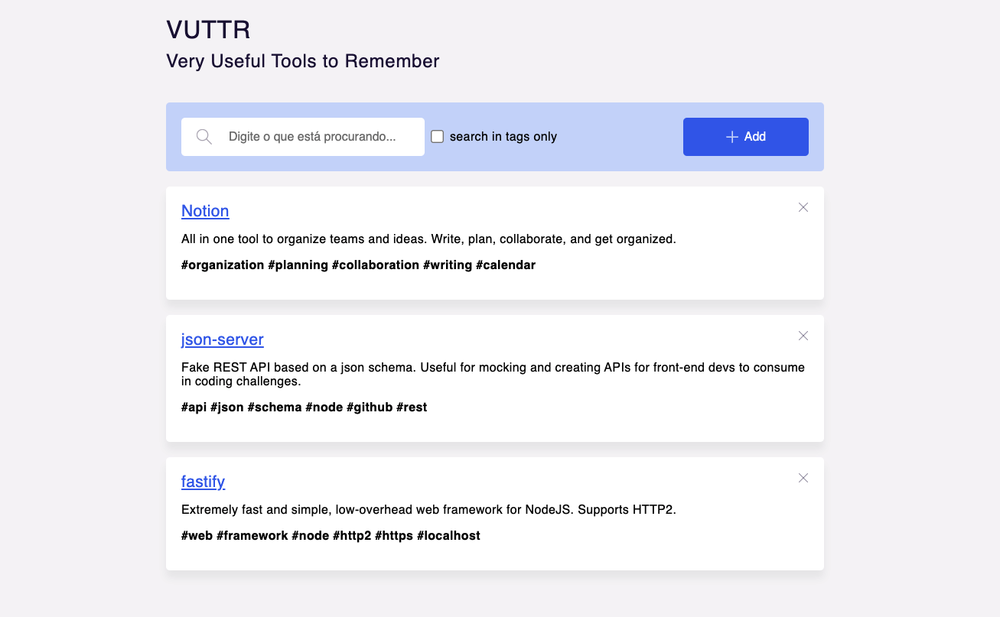

<h1 align="center">
  VUTTR - Very Usefull Tools to Remember (Frontend)
  <br>
</h1>

<h4 align="center">A repository to manage tools with them respective names, links, descriptions and tags. </h4>

<p align="center">
  <a href="#tecnologies">Tecnologies</a> •
  <a href="#how-to-run">Running the Project</a> •
  <a href="https://vuttr-frontend-tawny.vercel.app/">Demo</a>
</p>

<div align="center">
  <br>
  </a>
</div>
## Tecnologies

- ReactJs
- Styled Components
- Axios

## How To Run

To clone and run this application, you'll need [Git](https://git-scm.com) and [Node.js](https://nodejs.org/en/download/) (which comes with [npm](http://npmjs.com)) installed on your computer. From your command line:

```bash
# Clone this repository
$ git clone https://github.com/LarissaDornelas/vuttr-frontend

# Go into the repository
$ cd vuttr-frontend

# Install dependencies
$ npm install
```

After following the steps above you can start the application with this command:

```bash

$ npm run start:dev
```
